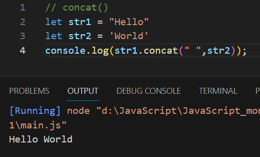
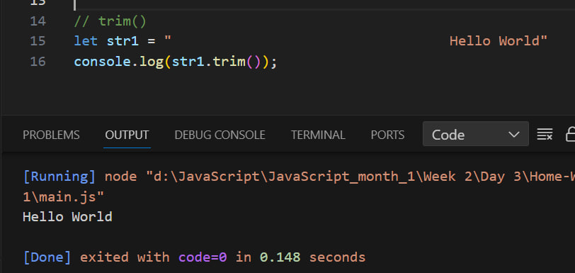
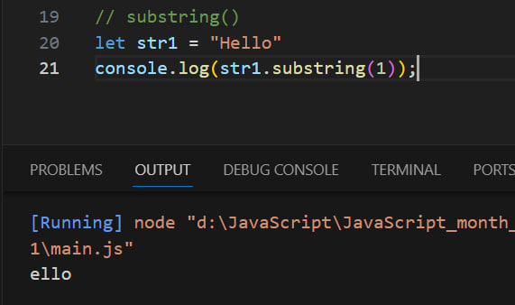

# JavaScript Strings
### На JavaScript есть 3 вида Strins
###### например:
#### 1. "Двойной ковичка"  -  " Hello World "
#### 2. ' ковичка'  -  ' Hello World '
#### 3. `  `  -  ` Hello World `
>
>
>
###  Методы strinng JavaScript 
#### concat(), trim(), includes(), indexOf(), replase(), replaseAll(), repeat(), slice(), substring(), split(), toSrting(), toLowerCase(), toUpperCase(), charAt() 

>
##### Напримеры
###### concat()  -  (соединяет две или более строк)

###### trim()  -  (удаляет пробелы с обеих сторон строки.)

###### includes()  -  (Метод Includes() возвращает true если строка содержит указанную строку)
###### indexOf(Метод indexOf возвращает позицию первого вхождения значения в строку.)
###### replace()
###### replaceAll()
###### repeat()
###### slice()
###### substring(Метод Substring() извлекает символы между двумя индексами (позициями) из строки и возвращает подстроку.)

###### 
###### 